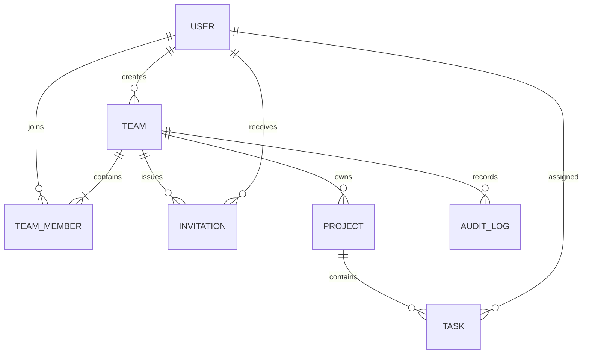
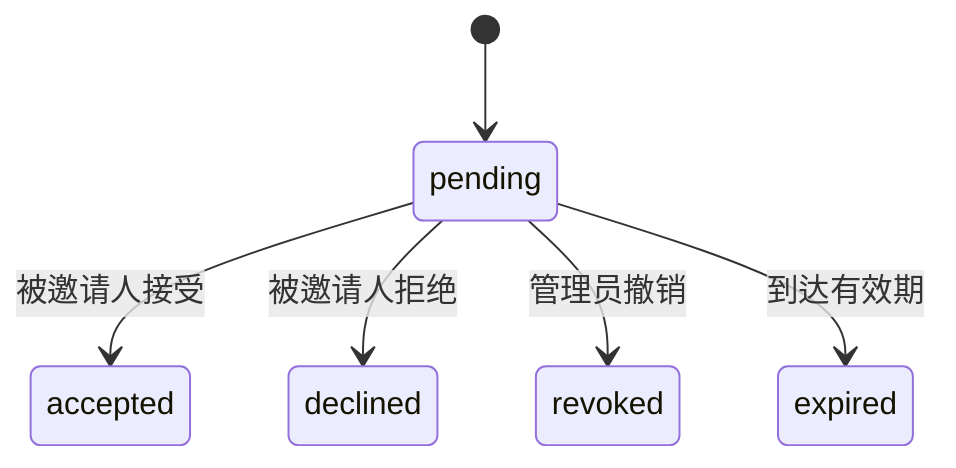

# Welo 团队协作与权限完整设计文档

| 项目 | 内容 |
| --- | --- |
| 版本 | V2.0 设计稿 |
| 日期 | 2026-09-11 |
| 适用范围 | 用户、团队、邀请、成员、项目、任务、甘特图、权限、数据迁移 |
| 状态 | 需求与技术设计；尚未按本文完成代码改造 |
| 技术基线 | 仓库现有 Vite / 原生 ES Module 前端、Hono / TypeScript API、Cloudflare Workers / D1 |
| 文档效力 | 本文是新版团队协作规则的设计依据；与旧产品、后端、数据库文档冲突时，新版实现以本文为准 |

## 1. 产品目标与需求边界

Welo 是一个以团队为协作和数据隔离单位的任务管理系统。用户注册后即可创建团队，并在自己加入的团队内创建项目、创建任务和协作修改。团队创建者自动成为该团队唯一的管理员，管理员仅在邀请成员和移除成员方面拥有额外权限。

### 1.1 已确认的核心需求

| 编号 | 用户需求 | 设计落点 |
| --- | --- | --- |
| R1 | 所有用户可以自行创建团队和项目 | 任意登录用户可创建团队；任意在队成员可在该团队创建项目 |
| R2 | 用户可以邀请其他用户加入自己的团队 | 用户在自己创建的团队中是管理员，可以发起邀请；在他人团队中作为普通成员时不能邀请 |
| R3 | 团队创建者，也就是第一个用户，是团队管理员 | 创建团队与创建首条成员关系必须一起成功；以团队创建者身份确定管理员 |
| R4 | 团队管理员可以把成员踢出团队 | 只允许移除本团队普通成员，立即撤销后续访问权限 |
| R5 | 管理员只有邀请和踢人两项额外权限 | 项目、任务、团队资料等业务权限不区分管理员与普通成员 |
| R6 | 任务只属于创建时的团队，其他团队不可见 | 团队为唯一隔离边界；不再以小组、创建人、负责人作为访问条件 |
| R7 | 成员可以创建任务并分配给同团队其他成员 | 负责人候选集合为本团队当前有效成员，包含自己和管理员 |
| R8 | 成员可以修改团队内任何项目、任何任务的所有数据 | 所有在队成员可以编辑任意任务的全部业务字段，创建人和负责人不产生独占权限 |

R2 按 R5 的更具体限制解释：不是所有普通成员都可以邀请。一个用户可在自己创建的 A 团队担任管理员，同时在受邀加入的 B 团队担任普通成员。

### 1.2 本版默认设计决策

以下是为形成完整方案补充的默认决策，不作为用户已经逐条明确提出的需求。

| 事项 | 本版方案 | 原因 |
| --- | --- | --- |
| 多团队 | 用户可创建、加入多个团队；项目必须归属于一个团队 | 支持独立协作空间，避免无团队项目 |
| 加入方式 | 管理员邀请已注册账号，对方在站内接受后加入 | 邀请不等于强制添加，不依赖邮件服务 |
| 邀请有效期 | 默认 7 天，以服务端时间为准 | 避免过期授权长期有效；这是产品参数 |
| 管理员数量 | 每个团队恰好一个，固定为创建者；本版不支持任命、转让 | 与“创建者即管理员”保持一致 |
| 项目操作 | 所有成员均可编辑、归档、恢复和软删除项目 | 避免产生第三项管理员特权 |
| 任务操作 | 所有成员均可软删除、恢复任务；支持同团队内移动项目 | 补齐任务生命周期和业务字段编辑 |
| 团队生命周期 | 所有成员可编辑资料、归档和恢复团队；本版不提供团队删除 | 保持权限平等，暂不引入解散后的归属与恢复流程 |
| 主动退出 | 普通成员可以退出；创建者本版不能退出 | 保证团队始终有一个有效管理员 |
| 踢人后的任务 | 保留任务及原负责人引用，显示“已离队”，允许成员重新分配 | 不丢历史，不阻塞踢人，不强制批量转交 |
| 删除恢复 | 项目、任务软删除后 30 天内可恢复；本版不提供用户硬删除 | 降低全员可编辑产生的误删成本 |
| 小组 | 从新版产品和权限中移除；旧小组数据仅保留迁移快照 | 让团队内全部任务自然可见 |
| 业务时区 | 本版统一 Asia/Shanghai，任务时间保留现有半小时精度 | 延续现有无时区日期格式，避免不同浏览器解释不同 |

### 1.3 本版不包含

不包含公开团队广场、任意用户自行加入团队、邀请未注册邮箱、邮件推送、共享邀请链接、项目私有成员、只读访客、自定义角色、跨团队移动或复制任务、管理员转让、账号注销、附件、评论、任务依赖与实时多人编辑。后续扩展必须保持团队隔离，不能默认增加管理员专属业务权限。

## 2. 核心领域与系统不变量

### 2.1 名词与关系

| 对象 | 含义 |
| --- | --- |
| 用户 User | 平台账号，拥有独立登录身份，不自带全局业务管理权 |
| 团队 Team | 数据隔离单位；包含成员、项目、任务和团队操作记录 |
| 成员 TeamMember | 用户在某团队中的有效成员关系；离队后保留历史关系 |
| 管理员 Admin | 当前用户是团队创建者且成员关系有效时得到的团队角色 |
| 邀请 Invitation | 管理员授予指定注册用户的一次加入机会，需要被邀请人确认 |
| 项目 Project | 只属于一个团队的任务容器，没有单独的权限层级 |
| 任务 Task | 必须属于一个项目，通过项目唯一确定所属团队 |
| 操作记录 AuditLog | 记录业务变更人与时间，供团队全体成员查看，不可由业务接口改写 |



### 2.2 必须始终成立的规则

1. 每个团队恰好一个管理员，且该用户是团队创建者和有效成员。
2. 新建团队时，创建者是第一位有效成员；不能出现仅有团队、没有管理员成员关系的中间结果。
3. 同一用户在同一团队最多一条成员关系；重复接受邀请不会生成重复成员。
4. 一个项目始终属于同一个团队；一个任务可以在该团队的项目间移动，但不能改变团队。
5. 创建任务或更换负责人时，目标负责人必须是当前有效成员；保留历史离队负责人是明确允许的例外。
6. 团队成员可查看团队内所有未删除项目和任务，包括加入前创建的内容及自己没有负责的内容。
7. 团队业务数据的写权限只来自当前有效团队成员关系；历史创建者和历史负责人不能绕过它。`super_admin` 仅拥有本节声明的平台只读查询能力，不能绕过团队业务读写约束。
8. “所有数据可修改”指业务字段；ID、团队归属、创建人、审计记录、版本和系统时间等受系统约束，不能伪造。
9. 归档只读、删除隐藏等生命周期约束对管理员和成员完全相同；专用恢复操作是明确例外。
10. 成员移除提交成功后，后续读取与写入必须失败；不会撤回移除前已被对方合法读取的信息。

## 3. 角色与权限矩阵

权限按“当前用户 + 当前团队”计算，不在账号上设置全局团队管理员角色。

| 操作 | 未登录 | 登录但不属于目标团队 | 普通成员 | 团队管理员 |
| --- | --- | --- | --- | --- |
| 创建新团队 | 否 | 是 | 是 | 是 |
| 查看目标团队资料、成员、项目、任务、统计 | 否 | 否 | 是 | 是 |
| 修改团队名称、描述 | 否 | 否 | 是 | 是 |
| 归档 / 恢复团队 | 否 | 否 | 是 | 是 |
| 查看当前有效成员列表 | 否 | 否 | 是 | 是 |
| 发起、撤销、重新发起邀请 | 否 | 否 | 否 | 是 |
| 查看团队邀请管理列表 | 否 | 否 | 否 | 是 |
| 移除团队其他普通成员 | 否 | 否 | 否 | 是 |
| 查看自己的邀请、接受 / 拒绝邀请 | 否 | 仅自己的 | 仅自己的 | 仅自己的 |
| 主动退出团队 | 否 | 否 | 是 | 否，创建者身份约束 |
| 创建、编辑、归档、恢复项目 | 否 | 否 | 是 | 是 |
| 软删除 / 恢复项目 | 否 | 否 | 是 | 是 |
| 创建、查看、修改任何任务 | 否 | 否 | 是 | 是 |
| 指派 / 改派任务负责人 | 否 | 否 | 是 | 是 |
| 甘特图拖动任务排期 | 否 | 否 | 是 | 是 |
| 同团队内移动任务到其他项目 | 否 | 否 | 是 | 是 |
| 软删除 / 恢复任务 | 否 | 否 | 是 | 是 |
| 查看团队业务变更记录 | 否 | 否 | 是 | 是 |
| 任命管理员 / 转让团队 / 删除团队 | 否 | 否 | 本版不提供 | 本版不提供 |
| 访问其他团队的项目或任务 | 否 | 否 | 否 | 否 |

“邀请管理列表、撤销和重邀”属于邀请权限的组成部分，不增加第三种角色特权。被邀请人可以在加入前查看邀请中的最小团队信息，但不能访问团队详情、成员或业务内容。

`systemRole = super_admin` 是平台只读运营角色，独立于团队角色。超级管理员可通过 `/admin/users` 查看全部注册用户，通过 `/admin/projects` 查看全部团队的项目目录和项目状态；这两个视图用于平台运营排查，不提供任务详情、团队成员列表、业务写入、角色修改或跨团队修改入口。普通用户访问这些接口返回 `403 FORBIDDEN`。角色变更仍不通过产品 API 开放，只能由受控运维流程修改数据库。

## 4. 用户与团队流程

### 4.1 注册、登录和初次使用

1. 沿用现有用户名、邮箱、密码注册登录及会话机制；注册后即可创建团队，不需要平台管理员审批。
2. 无有效团队时，页面展示“创建团队”和“我的邀请”；不创建默认小组，也不等待平台人员分配。
3. 有团队时，优先进入最近使用且仍有权限的团队，否则进入第一个有效团队。
4. 创建项目必须选择一个已加入的团队；无团队用户先创建团队或接受邀请。
5. 页面顶部提供团队切换。选择团队只改变当前浏览上下文，不赋予额外权限。

### 4.2 创建与管理团队

| 字段 | 规则 |
| --- | --- |
| 名称 | 去除首尾空白，2-64 字符；允许不同团队同名，使用 ID 区分 |
| 描述 | 可空，最多 500 字符 |
| 创建者 | 服务端取当前用户，客户端不可指定 |
| 状态 | 初始 `active`，可切换为 `archived` |

创建成功一次性返回团队、当前角色和成员数，自动进入该团队。请求失败不能残留无管理员团队；服务端通过 `Idempotency-Key` 处理创建重试，防止超时后重复建队。

任何有效成员均可编辑团队资料或归档团队。归档确认时提示其全部项目和任务进入只读。归档不改变项目各自的归档状态，团队恢复后仍保持原项目状态。所有成员可恢复团队；恢复是团队只读规则的专用例外。

归档期间允许查看、拒绝或撤销邀请、移除成员、主动退出和恢复团队；禁止新邀请、接受邀请、编辑资料及所有项目和任务写操作。这样归档仍可撤销访问权，但不会扩大访问范围。

### 4.3 邀请成员

本版采用“指定已注册账号 + 站内邀请箱”，不直接将对方加入团队。

1. 管理员进入当前团队的成员页，输入完整用户名或邮箱和可选留言（最多 500 字符）。邮箱仅作为账号查找键，不把未验证邮箱当作身份凭据。
2. 服务端精确查找账号，将邀请绑定到不可变的 `invitee_user_id`；接受邀请时验证登录账号 ID，不能只比较邮箱文本。
3. 普通用户邀请流程不提供全平台用户列表或模糊搜索。不存在的账号返回“无法邀请该账号，请核对账号或确认对方已注册”，不回传用户资料；该流程仍存在有限的账号存在性推断，使用速率限制控制枚举。平台只读用户列表仅面向 `super_admin`，不得复用为普通邀请搜索。
4. 目标已在队时返回 `409 ALREADY_TEAM_MEMBER`；目标是自己也按该规则处理。
5. 同一团队对同一用户最多一个待处理邀请。重复发起返回原有效邀请 `200`，不延长到期时间；新建为 `201`。
6. 被邀请人登录后在“我的邀请”中看到团队名称、邀请人、留言、到期时间，可接受或拒绝。
7. 接受时重新检查邀请归属、状态、到期时间、团队状态和邀请人仍为有效管理员；在同一原子操作中激活成员关系并标记邀请已接受。
8. 接受后成为普通成员，可立即看到团队所有项目及任务。接受另一团队邀请不影响已有团队。
9. 管理员可以撤销待处理邀请；拒绝、撤销、过期后，重新邀请生成新记录，历史记录不覆盖。

邀请状态：



状态一旦终结不回到 `pending`。过期依据 `expires_at <= 服务端当前时间` 判定，即使后台尚未把状态更新为 `expired` 也不能接受；创建新邀请时先原子地终结旧过期记录，避免唯一约束阻塞重邀。

重复接受已接受邀请：若用户仍是有效成员，返回 `200` 并展示当前团队；若用户后来已离队，返回 `409 INVITATION_ALREADY_USED`，绝不能借旧邀请重新加入。并发接受 / 撤销 / 拒绝仅允许一个状态转换成功，另一个请求返回冲突。

### 4.4 移除成员与主动退出

管理员可以移除普通成员，不能移除自己，不能操作其他团队的成员。普通成员退出只作用于自己，不等同于拥有移除他人的权限。

处理规则：

1. 二次确认展示成员名称、未完成任务数和“历史任务保留，可由团队成员重新分配”。任务数量查询使用当前团队范围。
2. 将成员关系从 `active` 改为 `removed` 或 `left`，保留原加入时间与离队事件。
3. 同时撤销该团队对该用户的待处理邀请，防止通过仍有效的旧授权重新进入；需要新的管理员邀请才能再加入。
4. 原创建项目、任务不删除、不转移；原负责人保留并标记“已离队”。任务记录不因成员离队而全部更新版本。
5. 负责人选择器排除离队成员；编辑标题等其他字段时允许保留历史负责人，改派时必须选择有效成员。再次选择同一个已离队账号也应拒绝。
6. 操作成功后，该用户在该团队的列表、详情、搜索、统计、甘特图、历史记录及所有写接口立即失去权限；全局登录会话和其他团队不受影响。
7. 管理员不能退出；本版不提供管理员转让，所以界面明确展示此约束，不创建无管理员团队。
8. 已离队用户再次受邀并接受时激活原成员关系，记录新的加入事件；未被改派的历史任务重新显示其在队身份，已被改派的任务不自动转回。

“立即失去权限”以移除事务提交为界：之后开始的请求必须被拒绝；写请求即使预检查发生在移除前，也必须在最终提交时重新验证成员关系。已完成的历史读取不可能从对方设备收回。

## 5. 项目与任务设计

### 5.1 项目

项目创建人仅用于记录来源，不拥有额外权限。团队中任何有效成员均能创建和管理该团队的所有项目。

| 字段 | 规则 |
| --- | --- |
| `name` | 2-64 字符，去首尾空白；同一团队内未删除项目名称唯一 |
| `description` | 可空，最多 2000 字符 |
| `teamId` | 由已验证的团队路径确定，创建后不可修改 |
| `status` | `active` / `archived` |
| 创建、修改信息 | 服务端维护，响应含创建者、最后修改者和时间 |

进行中项目可正常写任务。归档项目可查看，任务不可创建、修改、删除、恢复或移动；任意团队成员可通过专用操作恢复项目。项目自身允许在团队有效时软删除，即使项目已归档；恢复已删除项目保留原来的归档状态。

### 5.2 任务字段与编辑规则

| API 字段 | 创建要求 | 编辑规则 |
| --- | --- | --- |
| `title` | 必填，1-200 字符，纯空白无效 | 所有成员可改 |
| `detail` | 可空，最多 10000 字符，纯文本 | 所有成员可改；`null` 清空 |
| `assigneeId` | 必填，当前有效团队成员；默认自己 | 所有成员可改派给任何有效成员 |
| `startDate` | 可空，`YYYY-MM-DDTHH:mm` | 所有成员可改；分钟为 `00` 或 `30` |
| `endDate` | 必填，同上 | 所有成员可改，不能早于开始时间 |
| `status` | 默认 `todo` | `todo` / `in_progress` / `done` 可相互转换，不限制负责人 |
| `priority` | 默认 `medium` | `low` / `medium` / `high` / `urgent` |
| `projectId` | 创建时由项目路径确定 | 通过移动接口修改，只能移动到同团队有效项目 |
| `id`、`teamId` | 服务端确定 | 不允许修改；`teamId` 通过所属项目派生 |
| `createdBy`、`createdAt` | 当前登录用户、服务端时间 | 不允许修改 |
| `updatedBy`、`updatedAt` | 服务端维护 | 不允许直接赋值；`updatedAt` 同时作为并发版本 |
| `completedAt` | `done` 时由服务端生成 | 回退时清空，再完成时重新记录 |
| `deletedAt`、`deletedBy` | 初始为空 | 仅通过删除 / 恢复操作改变 |

`PATCH` 中未传字段保持原值；`null` 只用于允许清空的字段。服务端拒绝 `groupId`、`teamId` 等不允许提交的字段，不能静默忽略可能导致客户端误判的权限字段。校验时间时使用“旧值合并本次修改后的完整数据”，防止仅改单个时间绕过开始 / 结束校验。

所有任务业务字段均对成员开放，不要求当前用户是负责人、创建者、项目创建者或管理员。用户可把他人任务改为完成，也可调整其标题、详情、负责人、排期、优先级和所在项目。

任务排期统一解释为 Asia/Shanghai 本地墙上时间，API 保留现有无偏移量格式，前端不按浏览器本地时区自行转换；审计、邀请和版本时间统一使用 UTC ISO 8601。延期统计按 Asia/Shanghai 当前时间比较，不使用数据库 UTC 日期直接代替业务日期。

### 5.3 列表、统计和甘特图

- 团队工作台只统计当前团队的数据，提供项目数、任务数、我的未完成任务、逾期任务和近期截止任务。
- 项目列表、任务列表和甘特图共享团队访问规则。负责人、状态、优先级、关键词及时间筛选只是检索条件，不改变权限。
- “我的任务”是 `assigneeId = 当前用户` 的筛选视图，不是私有任务空间。
- 不再展示小组选择、任务所属小组和小组筛选；任务详情不要求小组字段。
- 任务列表分页，默认每页 20 条、最大 100 条；排序字段使用白名单，并用 ID 作为稳定的第二排序条件。
- 甘特图按时间窗口加载相交任务；需要分页时返回分页信息并明确加载剩余任务，不能静默截断。无开始时间任务按截止时间参与窗口过滤。
- 延续现有无开始时间任务的虚拟条形展示：`renderStartDate = endDate`、`isVirtualStart = true`，不落库补开始时间，不允许拖拽；成员可先在编辑表单补充开始时间。
- 有开始时间的任务允许所有成员拖拽，现有按天位移保留半小时时刻的交互继续使用。失败回滚，版本冲突提示重新加载。

### 5.4 删除、恢复与归档

1. 删除项目只设置项目删除标记，不批量改变任务自身的删除标记；常规查询通过项目状态统一隐藏其全部任务。
2. 恢复项目后，原本未删除的任务重新出现；原本独立删除的任务仍留在回收站，不能被连带恢复。
3. 删除任务设置任务删除标记，进入团队回收站；30 天内所有有效成员均可恢复，超期拒绝恢复，不因此自动物理清理。
4. 恢复任务要求父项目存在、未删除且处于进行中，团队也处于有效状态；否则先恢复团队 / 项目。
5. 恢复项目若与现有未删除项目同名，返回名称冲突，并允许在恢复请求中提供新名称。
6. 团队归档后回收站只读；团队恢复操作仍对所有有效成员开放。
7. 删除和恢复都校验版本，写入审计；管理员与成员无差异。前端提供二次确认，不能把删除包装成普通保存。

## 6. 前端信息架构与交互

沿用 `frontend-prototype/` 的既有样式、Lucide 图标和 API 封装，不因权限调整更换前端框架。

| 页面 | 主要内容 | 角色差异 |
| --- | --- | --- |
| 登录 / 注册 | 现有账号流程 | 无 |
| 无团队引导 | 创建团队、我的邀请 | 无 |
| 团队工作台 | 团队切换、项目、统计、创建项目 | 无 |
| 项目详情 | 任务列表、甘特图、创建任务、项目设置 | 无 |
| 任务详情 / 编辑 | 全部业务字段、同团队移动、删除、修改记录 | 无 |
| 团队成员 | 全部有效成员、角色标识、离队成员历史筛选 | 管理员有邀请和移除入口 |
| 邀请管理 | 团队待处理和历史邀请 | 管理员可见 |
| 我的邀请 | 当前账号收到的邀请、接受、拒绝 | 所有账号可见 |
| 团队设置 | 名称、描述、归档 / 恢复 | 所有成员一致 |
| 团队回收站 | 已删除项目、任务及可恢复期限 | 所有成员一致 |
| 个人设置 | 现有个人资料、颜色、退出登录 | 无 |

交互要求：

1. 团队切换器展示团队名称、当前角色、归档标记；同名团队补充创建者和 ID 后缀供区分。
2. 团队成员选择器显示用户名、颜色和角色，不返回成员邮箱；历史负责人显示“已离队”。
3. 普通成员不显示邀请和移除按钮；业务编辑按钮按生命周期控制，不能使用 `isAdmin` 隐藏。
4. 团队切换时取消未完成请求并清理旧页面状态，缓存键必须包含 `userId + teamId + resourceId + filters`；迟到的旧团队响应不得覆盖新团队页面。
5. 团队资源请求返回 `404` 时先关闭相关编辑界面并刷新我的团队列表；若已不在队，清理该团队缓存并跳转其他团队或引导页。
6. 本版不引入 WebSocket；页面恢复焦点时和团队页面每 30 秒检查成员资格，因此已打开页面可能短暂保留旧显示，但后端在每次请求时即时拒绝离队用户。
7. 保存中固定按钮尺寸并禁用重复提交；创建团队使用幂等键；邀请和接受操作支持安全重试。
8. `409 VERSION_CONFLICT` 时保留用户本次草稿，提示数据已被其他成员更新，提供重新加载后对比再提交；不自动覆盖其他人的变更。
9. 成员被移除、邀请已过期、项目已归档、已删除资源等情况有独立提示，不统一提示“网络错误”。

## 7. 后端架构与鉴权

### 7.1 架构与职责

```text
现有 Vite SPA
  -> /api/v1 + 现有 Cookie / Bearer 会话
  -> 身份认证
  -> 团队成员检查 + 资源归属检查
  -> 生命周期、字段和版本校验
  -> D1 条件写入 + 同步审计
```

保留 Hono、Zod、D1 和现有统一响应结构。实施时将当前集中在 `src/index.ts` 的团队访问判定提取为可复用模块；邀请服务与成员服务封装各自的原子业务操作，无需为本次权限调整引入新的服务或数据库。

建议职责：`auth` 仅提供账号身份，`team-access` 解析有效成员与管理员，`project-access` 校验项目所属团队，`task-access` 校验任务所属项目，邀请 / 成员服务处理状态变化，审计服务参与同一写操作。

### 7.2 权限判定顺序

1. 校验会话，无效返回 `401 UNAUTHENTICATED`。
2. 查当前团队有效成员关系，不存在则返回 `404 NOT_FOUND`。
3. 校验路径中项目属于团队、任务属于项目；不可见或不匹配统一返回 `404`。
4. 仅在邀请或移除操作中要求当前成员为团队创建者；普通成员返回 `403 FORBIDDEN`。
5. 检查归档、删除、负责人资格、目标项目、版本等业务条件。
6. 最终写入语句再次约束成员关系、资源归属、状态和版本；不能依赖此前单独查询的结果作为唯一写入保护。

读取示意，任务团队归属经项目派生，不再连接小组决定可见性：

```sql
SELECT t.*
FROM tasks t
JOIN projects p ON p.id = t.project_id
JOIN team_members m ON m.team_id = p.team_id
WHERE m.user_id = :currentUserId
  AND m.status = 'active'
  AND p.team_id = :teamId
  AND p.id = :projectId
  AND t.id = :taskId
  AND p.deleted_at IS NULL
  AND t.deleted_at IS NULL;
```

上述是目标查询设计，现有表尚需第 8 节迁移。列表、数量查询、统计子查询、甘特图、回收站和审计全部复用同一团队范围；回收站只改变删除条件，不绕过成员检查。成员可见信息只包含完成协作所需资料，不因为同队而开放邮箱或安全信息。

### 7.3 并发与原子性

| 操作 | 必须一起提交的内容 |
| --- | --- |
| 创建团队 | 团队、创建者有效成员关系、幂等结果、审计 |
| 接受邀请 | 有效邀请条件、成员激活、邀请终态、审计 |
| 移除 / 退出成员 | 成员状态变化、待处理邀请撤销、审计 |
| 修改 / 移动任务 | 当前权限、源与目标项目状态、目标负责人资格、版本条件、任务更新、审计 |
| 删除 / 恢复 | 当前权限、状态与版本条件、删除字段更新、审计 |

这些操作必须使用 D1 支持的原子执行机制落地，不能把若干独立请求视为事务。实现前按当时官方 D1 文档核对批量语句的事务行为、约束和失败语义，并在本地 D1 验证回滚。特别注意：条件写入影响 0 行不等于 SQL 执行失败，不能指望它自动回滚其他语句；后续写入须依赖本次成功变更的标记，或通过约束使整个业务单元失败。

任务修改、拖拽、移动、删除、恢复统一要求 `expectedUpdatedAt`；团队和项目更新也使用该字段。服务端做数据库条件更新，并生成严格递增版本，沿用现有 `nextTaskVersion` 的单毫秒递增原则。缺少版本返回 `400`，旧版本返回 `409 VERSION_CONFLICT`。成功返回新版本，前端用它替换缓存。

分配与踢人并发时：若踢人先提交，后续指派给该成员必须失败；若指派先提交而踢人后提交，则该任务保留离队负责人，符合历史规则。任务跨项目移动只在源项目和目标项目同团队且都可写时成功。

邀请的状态转换与到期校验在最终写入时执行；不能只在打开邀请详情时检查。邀请接受后又离队的情形必须由实时成员关系判断，不能回放幂等缓存而把用户重新加入。

## 8. 数据库目标设计

以下为目标模型和迁移要求，不是已执行的建表脚本。继续使用当前整数主键，API 将 ID 输出为字符串。

### 8.1 表与关键字段

| 表 | 目标字段 / 调整 | 约束 |
| --- | --- | --- |
| `users` | 保留账号、密码哈希、颜色、登录安全字段 | `system_role` 可暂保留兼容存储，但不参与团队授权 |
| `teams` | `id, name, description, status, created_by, created_at, updated_at, updated_by` | `created_by` 不可更改；取消团队名称全局唯一约束 |
| `team_members` | 原字段加 `status, joined_at, ended_at, ended_by, updated_at` | `UNIQUE(team_id, user_id)`；状态 `active/removed/left`；创建者必须有效 |
| `team_invitations` | `id, team_id, inviter_user_id, invitee_user_id, message, status, expires_at, responded_at, created_at, updated_at` | 状态枚举见邀请流程；邀请目标和团队不可变 |
| `projects` | 原字段加 `updated_by, deleted_by` | `team_id` 不可变；未删除项目的 `(team_id, name)` 唯一 |
| `tasks` | 保留现有业务字段，加 `updated_by, deleted_by`；移除业务 `group_id` | 团队经 `project_id` 唯一确定；负责人保留用户外键 |
| `audit_logs` | `id, team_id, actor_id, action, entity_type, entity_id, before_json, after_json, request_id, created_at` | 仅服务端追加；JSON 使用结构化序列化；不得含密码或会话 |
| `idempotency_keys` | `user_id, operation, key, request_hash, resource_id, created_at, expires_at` | `UNIQUE(user_id, operation, key)`；本版用于团队创建，保留 24 小时 |
| `sessions` | 沿用当前会话表 | 会话仅证明登录身份，不保存长期有效的团队权限快照 |

管理员角色由 `teams.created_by = user.id` 且成员 `status = active` 派生。成员表不另存可写 `role`，避免角色与创建者出现双重真相；API 可返回派生的 `role: admin | member`。

有效成员 `ended_at` / `ended_by` 为空，离队时记录结束时间和操作者；再次加入更新 `joined_at` 并清空结束字段，原始 `created_at` 不变，历次成员变化通过审计保留。`assignee_id` 不绑定“有效成员”外键，因为离队负责人是合法历史数据；有效资格由创建和改派时的业务条件控制。

幂等键与当前用户、操作和规范化请求摘要绑定：相同键相同内容返回既有团队，相同键不同内容返回 `409 IDEMPOTENCY_CONFLICT`。键过期后允许重新使用；重放响应前仍校验资源访问资格。邀请操作通过唯一约束和状态机实现自身幂等。

### 8.2 索引与约束

- `team_members(user_id, status, team_id)`：查询我的团队。
- `team_members(team_id, status, user_id)`：读取成员、校验访问与负责人资格。
- `team_invitations(invitee_user_id, status, expires_at)`：我的邀请。
- `team_invitations(team_id, status, created_at)`：团队邀请管理。
- `team_invitations(team_id, invitee_user_id) WHERE status = 'pending'` 的唯一索引：避免重复待处理邀请，过期状态先转换再重邀。
- `projects(team_id, status, deleted_at)`：团队项目列表；`(team_id, name) WHERE deleted_at IS NULL` 的唯一索引：允许删除后重用名称。
- `tasks(project_id, deleted_at, end_date, id)`：任务分页与截止时间筛选。
- `tasks(project_id, assignee_id, status)`：项目负责人和状态查询。
- `audit_logs(team_id, created_at, id)`：团队操作记录分页。
- 保留任务时间顺序、状态 / 完成时间一致性检查和全部用户、项目外键。执行计划和实际数据规模决定是否增加更多索引。

跨表不变量（创建者始终有效、项目移动不得换团队、改派对象仍在队）必须通过服务端原子写入及适用的数据库约束保障，不能仅依赖界面禁用按钮。涉及表重建时保持 ID 与外键引用，禁止改写已执行的历史迁移文件。

### 8.3 审计规则

记录团队创建 / 编辑 / 归档 / 恢复、成员加入 / 移除 / 退出、项目和任务增改删恢复及任务移动。任务变更记录字段前后值，团队内全部有效成员可查看。

邀请创建、拒绝、撤销和过期也记录，但通用团队审计响应须隐藏邀请留言、目标账号等未入队人的信息，只给出操作类型与时间；完整邀请事件仅向管理员及对应受邀人按各自范围提供。审计不可被任何成员编辑或删除，存储增长与保留期限需要独立运营策略，本版不做自动清理。

## 9. API 目标契约

### 9.1 兼容策略与通用约定

继续使用 `/api/v1` 前缀以减少路径改动，但本次权限、任务字段和新增流程属于不兼容升级，必须前后端同步切换。下表全部是新版目标契约，不代表当前接口已经实现；实施时同步更新 `Docs/api-docs.yaml` 与前端接入说明。

继续使用现有 `{ data, meta: { requestId, pagination } }` 成功结构和 `{ error: { code, message, details? }, meta: { requestId } }` 错误结构。创建返回 `201`，读取、修改、删除及状态转换返回 `200`；无数据时 `data: null`。分页使用 `page/pageSize` 与 `total/totalPages`。

### 9.2 团队、成员与邀请

| 方法与路径（均省略 `/api/v1`） | 说明 | 权限与关键参数 |
| --- | --- | --- |
| `GET /auth/me` | 当前用户及引导状态 | `onboardingRequired` 根据有效团队数计算 |
| `GET /teams` | 只返回我的有效成员关系对应团队 | 包含归档团队，返回 `role` |
| `POST /teams` | 自行创建团队 | 任意登录用户；`name, description?`；要求 `Idempotency-Key` |
| `GET /teams/:teamId` | 团队详情 | 有效成员 |
| `PATCH /teams/:teamId` | 修改资料 | 所有有效成员；`name?, description?, expectedUpdatedAt` |
| `POST /teams/:teamId/archive` | 归档 | 所有有效成员；`expectedUpdatedAt` |
| `POST /teams/:teamId/restore` | 恢复归档团队 | 所有有效成员；`expectedUpdatedAt` |
| `GET /teams/:teamId/members` | 成员列表 | 所有有效成员；默认有效成员，可显式筛选离队历史 |
| `DELETE /teams/:teamId/members/:userId` | 移除普通成员 | 当前团队管理员；目标不能是自己 |
| `POST /teams/:teamId/leave` | 主动退出 | 普通成员 |
| `POST /teams/:teamId/invitations` | 发起邀请 | 当前团队管理员；`account, message?` |
| `GET /teams/:teamId/invitations` | 团队邀请分页 | 当前团队管理员；可按 `status` 筛选 |
| `POST /teams/:teamId/invitations/:invitationId/revoke` | 撤销待处理邀请 | 当前团队管理员；邀请必须属于路径团队 |
| `GET /users/me/invitations` | 我的邀请分页 | 当前账号；仅返回发给自己的邀请 |
| `POST /users/me/invitations/:invitationId/accept` | 接受邀请 | 必须是邀请绑定账号；返回团队及当前角色 |
| `POST /users/me/invitations/:invitationId/decline` | 拒绝邀请 | 必须是邀请绑定账号 |

旧 `POST /teams/:teamId/members` 直接添加成员方式停用，已登录调用返回 `410 API_RETIRED`，不得把新邀请界面接到直接加人接口上。移除已离队成员返回 `200` 作为幂等结果，但仍必须校验请求人当前管理员权限和目标曾属于本团队。

### 9.3 项目、任务与查询

为缩短表格，定义路径占位：`T = /teams/:teamId`，`P = T/projects/:projectId`，`K = P/tasks/:taskId`；都是上述前缀后的完整路径展开，不是新的 API 别名。

| 方法与路径 | 说明 | 关键参数 |
| --- | --- | --- |
| `GET T/projects` | 项目分页 | `status?, keyword?, page?, pageSize?` |
| `POST T/projects` | 创建项目 | `name, description?` |
| `GET P` | 项目详情 | 团队 / 项目路径一致 |
| `PATCH P` | 编辑项目 | `name?, description?, expectedUpdatedAt` |
| `POST P/archive` / `POST P/restore` | 归档 / 恢复归档项目 | `expectedUpdatedAt` |
| `DELETE P` | 软删除项目 | JSON 请求体 `expectedUpdatedAt` |
| `GET P/tasks` | 任务分页 | `assigneeId?, status?, priority?, keyword?, startDate?, endDate?, sortBy?, sortOrder?` 及分页 |
| `POST P/tasks` | 创建任务 | 第 5.2 节可创建业务字段，不含 `groupId` |
| `GET K` | 任务详情 | 团队 / 项目 / 任务路径一致 |
| `PATCH K` | 编辑任务 | 第 5.2 节普通可编辑字段及 `expectedUpdatedAt` |
| `PATCH K/schedule` | 甘特图排期 | `startDate, endDate, expectedUpdatedAt`，开始时间不得为虚拟值 |
| `POST K/move` | 同团队内移动项目 | `targetProjectId, expectedUpdatedAt`；返回更新后的任务路径信息 |
| `DELETE K` | 软删除任务 | JSON 请求体 `expectedUpdatedAt` |
| `GET P/gantt` | 甘特图 | 时间窗口、负责人、状态、优先级及分页 |
| `GET T/dashboard` | 当前团队统计 | 所有有效成员使用相同查询范围 |
| `GET T/trash` | 回收站分页 | `type=project或task`、分页；返回资源版本与可恢复期限 |
| `POST T/trash/projects/:projectId/restore` | 恢复软删除项目 | `expectedUpdatedAt, name?` |
| `POST T/trash/tasks/:taskId/restore` | 恢复软删除任务 | `expectedUpdatedAt`；从数据库解析其父项目 |
| `GET T/activity` | 团队业务操作记录分页 | `entityType?, entityId?`、分页；应用邀请信息脱敏规则 |

上述所有接口均面向有效团队成员，没有管理员专属项目或任务接口。时间范围参数均按第 5.2 节格式校验；有开始时间的任务按区间相交匹配，无开始时间按截止时间匹配；`startDate > endDate` 的筛选返回 `400`。统计和普通列表排除已软删除项目及任务；归档内容可按状态查看。

### 9.4 平台只读管理

| 方法与路径（均省略 `/api/v1`） | 说明 | 权限与关键参数 |
| --- | --- | --- |
| `GET /admin/overview` | 平台规模概览 | 仅 `super_admin`；用户、活跃团队、进行中项目、未删除任务计数 |
| `GET /admin/users` | 全部用户分页 | 仅 `super_admin`；`keyword?, systemRole?, page?, pageSize?` |
| `GET /admin/projects` | 全部团队项目目录分页 | 仅 `super_admin`；`keyword?, status?, teamId?, page?, pageSize?`，返回团队摘要、删除状态与未删除任务数 |

平台只读管理接口不返回任务明细、任务负责人、团队成员或邀请内容，也不能用于修改用户、团队、项目或任务。旧角色修改接口继续保持停用。

### 9.5 核心响应示例

创建团队请求：

```http
POST /api/v1/teams
Content-Type: application/json
Idempotency-Key: 38a1e7f0-2391-4e5a-a408-e549d66d18ae

{"name":"产品研发团队","description":"产品与研发共同协作"}
```

```json
{
  "data": {
    "id": "12",
    "name": "产品研发团队",
    "description": "产品与研发共同协作",
    "status": "active",
    "createdBy": { "id": "7", "username": "zhangsan" },
    "role": "admin",
    "memberCount": 1,
    "updatedAt": "2026-09-11T02:00:00.000Z"
  },
  "meta": { "requestId": "req_example", "pagination": null }
}
```

任务响应核心结构：

```json
{
  "id": "101",
  "teamId": "12",
  "projectId": "31",
  "title": "完成首页设计",
  "detail": "整理首页信息层级并完成设计稿",
  "assignee": { "id": "8", "username": "lisi", "color": "#2563EB", "isActiveMember": true },
  "startDate": "2026-09-11T09:00",
  "endDate": "2026-09-12T18:30",
  "renderStartDate": "2026-09-11T09:00",
  "isVirtualStart": false,
  "status": "in_progress",
  "priority": "high",
  "completedAt": null,
  "createdBy": { "id": "7", "username": "zhangsan" },
  "updatedBy": { "id": "8", "username": "lisi" },
  "createdAt": "2026-09-11T02:00:00.000Z",
  "updatedAt": "2026-09-11T03:00:00.001Z"
}
```

成员资料、邀请、项目和回收站的完整字段结构在实施阶段写入 OpenAPI，并用前后端契约测试约束；任何新增权限字段都必须是服务端派生值。

### 9.5 错误契约

| HTTP | 错误码 | 使用场景 |
| --- | --- | --- |
| 400 | `VALIDATION_ERROR` | 字段、ID、时间、版本参数缺失或格式错误 |
| 401 | `UNAUTHENTICATED` | 未登录或会话过期 |
| 403 | `FORBIDDEN` | 有效普通成员执行邀请 / 移除等管理员操作 |
| 404 | `NOT_FOUND` | 非成员、资源不存在、路径归属错误、操作不属于自己的邀请 |
| 409 | `TEAM_ARCHIVED` / `PROJECT_ARCHIVED` | 生命周期不允许当前写操作 |
| 409 | `VERSION_CONFLICT` | 资源已经被其他成员修改 |
| 409 | `ASSIGNEE_NOT_TEAM_MEMBER` | 创建 / 改派给非有效成员 |
| 409 | `ALREADY_TEAM_MEMBER` | 邀请目标已经在队 |
| 409 | `INVITATION_EXPIRED` / `INVITATION_NOT_PENDING` / `INVITATION_ALREADY_USED` | 邀请不能接受或转换状态 |
| 409 | `ADMIN_CANNOT_LEAVE` / `CANNOT_REMOVE_ADMIN` | 创建者不能退出或被移除 |
| 409 | `PROJECT_NAME_CONFLICT` | 新建、改名或恢复项目重名 |
| 409 | `RESTORE_EXPIRED` / `PARENT_NOT_ACTIVE` | 恢复期限已过或父级不允许恢复 |
| 409 | `IDEMPOTENCY_CONFLICT` | 相同幂等键绑定了不同请求 |
| 410 | `API_RETIRED` | 已停用的小组、角色修改和直接添加成员接口 |
| 429 | `RATE_LIMITED` | 创建 / 邀请 / 认证等触发产品频率限制 |

非成员请求必须先返回 `404`，不能通过 `TEAM_ARCHIVED`、版本冲突或负责人错误泄漏隐藏团队状态。无效负责人统一按“非本团队成员”处理，不透露其真实团队。

## 10. 安全、可靠性与性能

1. 沿用当前密码哈希与哈希会话存储，不接受客户端提交的管理员角色、创建者或授权团队列表。
2. 每次敏感读写查询有效成员关系，权限检查不使用可能落后的成员缓存；部署若启用读副本，授权判断和关键状态转换必须采用能保证当前权限的读取方式。
3. 所有用户数据接口使用私有且不存储的缓存策略；CDN 不缓存带会话的团队数据。多账号退出登录时清理应用缓存。
4. Cookie 写请求校验允许的 Origin 并采用明确 CSRF 防护，不能把 CORS 当成完整 CSRF 防线；文本输出转义，SQL 使用参数绑定。
5. 邀请创建默认每管理员每团队每小时 20 次、每管理员全局每小时 100 次；团队创建默认每账号每天 10 次。均为可配置产品初值，不是平台额度；幂等重试不重复消耗额度，鉴权发生在返回速率限制详情前。
6. 操作日志包含请求 ID、操作者、团队 ID、资源 ID、结果和耗时；不记录密码、会话、完整认证头。拒绝跨团队请求也不回传隐藏资源信息。
7. 不将关键成员变更或审计写入仅放在响应后的后台任务中；成功响应意味着相关业务单元已经提交。
8. 设计性能目标：100 个成员、50 个项目、单项目 1000 个任务的测试团队中，常规分页读取服务端 P95 小于 500ms，关键写入 P95 小于 800ms；实际需在目标环境测量，当前不是已达成承诺。
9. 甘特图采用时间窗口与渐进加载，成员选择器使用分页或按当前团队搜索；禁止为选择负责人下载平台所有用户。

## 11. 现有系统改造与迁移

### 11.1 已核实的当前代码差异

| 当前仓库行为 | 新版要求 | 主要改造位置 |
| --- | --- | --- |
| 创建团队、管理成员调用 `requireAdmin` | 所有人可建队，管理员权限按团队创建者计算 | `src/index.ts`、`src/shared/auth.ts` |
| `teamAccess` 对 `super_admin` 放行 | 所有用户都必须有有效成员关系 | 团队访问与全部查询分支 |
| 小组成员决定任务可见性 | 同团队任务全部可见 | `visibleTask`、列表、甘特图、工作台 SQL |
| 任务必须有 `group_id`，负责人属于小组 | 移除小组字段，负责人属于团队 | 任务 DTO、Zod 校验、数据库和前端表单 |
| 项目更新 / 删除、任务删除为超管专属 | 全部成员同权，统一生命周期约束 | 项目 / 任务路由和前端动作可见性 |
| 直接添加团队成员 | 指定账号邀请并由本人接受 | 新邀请表、邀请服务、我的邀请界面 |
| 任务普通修改的 `expectedUpdatedAt` 可选 | 所有共享资源写操作要求版本 | API 校验、条件更新和前端提交 |
| 团队名称全局唯一、项目名称包含删除记录仍唯一 | 团队可同名，项目只约束未删除名称 | 递增迁移与唯一索引 |
| 现有排期已为半小时格式 | 延续格式，补充统一业务时区规则 | 前端时间解析和统计查询 |

上表根据本次本地代码检查整理，只描述代码，不代表生产环境已检查。`Docs/前端接入说明.md` 和 `Docs/api-docs.yaml` 在代码改造前仍描述旧 API，不能当作新版已上线证明。

### 11.2 数据迁移策略

1. 在现有 `0001`、`0002`、`0003` 之后新增递增迁移，不修改已经执行过的文件；先备份并在隔离数据库演练。
2. 建立逐团队预检报告：成员、创建者、项目、任务数量，项目与原小组团队是否一致，负责人是否在项目所属团队。
3. 旧团队创建者优先使用 `teams.created_by`。由于旧版团队可能由平台超管代建，该账号未必是实际业务创建者：迁移前核实并形成逐团队管理员映射；存在代建歧义时不能擅自取成员 ID 最小者或最早加入者作为管理员。仅在本次迁移中允许按已确认映射修正创建者，正常运行后不可修改。
4. 为确定的创建者补齐有效成员关系，原团队成员全部迁为 `active`。不能按旧小组成员集合决定新版团队成员，也不能自动把跨团队异常负责人加入团队。
5. 从 `tasks.project_id -> projects.team_id` 确定任务团队。原小组与项目跨团队的异常记录先隔离报告并处理，不静默搬移任务或扩大成员访问。
6. 原负责人不在团队时保留负责人引用并显示“已离队”；历史创建者亦可不在队，不因此获得权限。
7. 备份旧小组、成员与任务小组映射后重建任务表去除业务 `group_id`，完整复制任务 ID、日期、状态、软删除和创建信息；新版查询不再依赖旧表。
8. 旧 `team_groups` / `group_members` 可暂作为只读迁移遗留保留，但 API 不再使用。先停用入口，不在权限切换时顺手物理删除历史数据。
9. 重建团队 / 项目唯一约束，增加邀请、审计、幂等表及索引。历史 `updated_by` 无法恢复时设为可空并显示“历史记录”，不伪造最后修改者。
10. 检查外键、行数、ID、日期、任务归属、已删除状态、每团队恰好一个有效创建者，输出迁移前后核对报告。

本次迁移会让旧版同团队不同小组的成员互相看到全部任务，这是用户要求的权限变化。上线说明必须明确这一点；此前依靠小组隔离的业务若仍需要互相不可见，应先拆分为不同团队并确认数据归属。

### 11.3 切换与回退

1. 完成新版后端、前端、OpenAPI、迁移和回归测试，先在隔离环境全流程验收。
2. 安排受控切换窗口，暂时关闭团队业务读写，避免旧服务在新结构上运行，或旧超管 / 小组逻辑在过渡期间返回错误范围。
3. 核实目标数据库和备份，执行迁移并验证，再发布对应新版后端与前端。迁移未通过时不得开放业务流量。
4. 旧小组、平台管理、直接加人接口统一停用；旧客户端刷新加载新版，不能保留仍可绕过权限的兼容写路径。
5. 生产验收：普通账号创建团队、邀请另一个账号、跨成员编辑任务、踢人后访问失败、另一个团队始终不可见。
6. 若需要回退，维持维护状态并恢复匹配版本的代码和数据库方案；不能只回退代码。新版新增任务没有旧小组映射，恢复旧模型需要明确回填方案；恢复旧快照会丢失切换后写入，因此先保存增量并决定重放方案。

## 12. 测试与验收标准

测试身份：A 创建团队甲；B、C 接受邀请加入甲；B 另外创建团队乙；D 只加入乙。A 是甲管理员，B 在甲是普通成员、在乙是管理员，C 与 D 是普通成员。

| 编号 | 验收操作 | 预期结果 |
| --- | --- | --- |
| A01 | 全新注册账号创建团队 | 不需超管审批；团队有且只有自己一位成员，角色为管理员 |
| A02 | 相同幂等键重试创建团队 | 只有一个团队和一条首成员关系；不同内容同键返回冲突 |
| A03 | B 在甲创建项目、任务 | 成功，不依赖管理员身份或小组 |
| A04 | A 在甲邀请 C；C 接受前后读取甲 | 接受前不可读，接受后可读甲内全部历史任务 |
| A05 | B 在甲发邀请、移除 C | 均 `403`；B 在自己创建的乙可邀请和移除普通成员 |
| A06 | C 编辑 A 创建、B 负责的任务所有业务字段 | 标题、详情、负责人、时间、状态、优先级均可修改 |
| A07 | C 将任务移动到甲的另一项目 | 成功；移动到乙失败，任务仍属于甲 |
| A08 | A、B、C 指派给甲的任意有效成员 | 均成功；指派给只在乙的 D 失败 |
| A09 | D 猜测甲的团队 / 项目 / 任务 ID | 列表、详情、统计、甘特图、回收站、日志和写入全部无权 |
| A10 | 同时属于甲乙的 B 混用两团队路径 ID | 归属校验失败，不能混写或关联跨团队项目与任务 |
| A11 | A 移除 B | B 立即失去甲的后续读写权限，仍可访问乙；B 的甲任务和创建记录保留 |
| A12 | B 离队后，C 改其任务标题并重新分配 | 保留历史负责人时可改其他字段，改派给在队成员成功 |
| A13 | B 使用过去已接受邀请重新加入甲 | 返回 `INVITATION_ALREADY_USED`；必须重新受邀 |
| A14 | 他人接受 C 的邀请、接受过期或撤销邀请 | 不加入团队；分别返回不可见或邀请状态错误 |
| A15 | 接受与撤销邀请并发，重复接受 | 最多一个有效成员关系；状态与成员结果一致 |
| A16 | 踢人与任务写入 / 指派并发 | 踢人先提交则后续越权写与指派失败，不出现离队后新增授权 |
| A17 | A、C 使用相同旧版本编辑任务 | 只有一次成功，另一次 `VERSION_CONFLICT`，草稿可保留 |
| A18 | 删除 / 拖拽 / 移动使用旧版本 | 均冲突，不能覆盖最新修改 |
| A19 | 普通成员编辑 / 归档 / 恢复团队或项目 | 权限与管理员一致；归档后业务写入被一致拒绝 |
| A20 | 删除项目再恢复 | 任务随项目隐藏和重新出现，之前独立删除任务仍保持删除 |
| A21 | 恢复同名项目、过期任务或父项目不可用任务 | 对应名称、期限或父级状态错误，不产生部分恢复 |
| A22 | 创建者退出 / 移除自己；普通成员主动退出 | 前两项失败，普通成员退出成功，始终保留有效管理员 |
| A23 | 旧 `super_admin` 无成员关系访问甲 | 与其他非成员一样被拒绝 |
| A24 | 小组、直接加人、平台管理员旧接口 | 停用，不能成为绕过新版权限的入口 |
| A25 | 无开始时间任务与 30 分钟精度任务 | 虚拟开始不入库、不拖拽；合法时间保存一致，非法分钟被拒绝 |
| A26 | 快速切换甲乙、旧响应迟到、离队后恢复页面焦点 | 不串团队内容；清理失效缓存并重新选择有效团队 |
| A27 | 注入数据库失败测试创建团队 / 接受邀请 / 移除成员 | 业务单元全部回滚，不出现孤立团队、邀请与成员状态不一致 |
| A28 | 迁移旧库，含跨组和异常归属数据 | 正常团队全员互见；跨团队异常进入报告；原 ID、任务及删除状态可核对 |

验证分层：领域规则和状态机单元测试；本地 Worker + D1 的实际 API / SQL 集成测试；双账号及多团队浏览器流程；迁移演练；受控生产验收。仓库现有 `npm test` 主要覆盖类型、格式和构建，通过它不足以证明权限隔离或邀请并发正确。

## 13. 实施拆分与完成标准

| 阶段 | 交付物 | 完成条件 |
| --- | --- | --- |
| 1. 契约与迁移准备 | 目标 OpenAPI、逐团队管理员映射、数据预检和新迁移 | 字段、权限、历史归属和切换策略一致 |
| 2. 团队权限基础 | 自助建队、成员访问判定、移除超管和小组绕过 | A01-A03、A09-A10、A23-A24 通过 |
| 3. 成员协作闭环 | 邀请箱、邀请管理、接受 / 拒绝 / 撤销、移除 / 退出 | A04-A05、A11-A16、A22、A27 通过 |
| 4. 全员业务操作 | 项目 / 任务完整同权、负责人、版本、移动、回收站、审计 | A06-A08、A17-A21、A25 通过 |
| 5. 前端与联调 | 去小组 UI、团队角色、缓存隔离、错误与并发交互 | A26 及双账号浏览器流程通过 |
| 6. 发布验收 | 迁移核对、接口文档、回退方案、部署和验收记录 | A28 通过，完整验收无越权；实际发布结果另行记录 |

最终验收必须同时满足：普通用户能从注册独立走通创建团队和项目；管理员邀请他人并由对方接受；任意成员可修改同团队任意任务；管理员只多邀请和移除权限；非团队成员在任何入口都看不到团队业务数据；移除成员后访问立即失效且历史任务不丢失。

本文只交付设计，不表示以上接口、数据库变更或上线操作已经完成。
