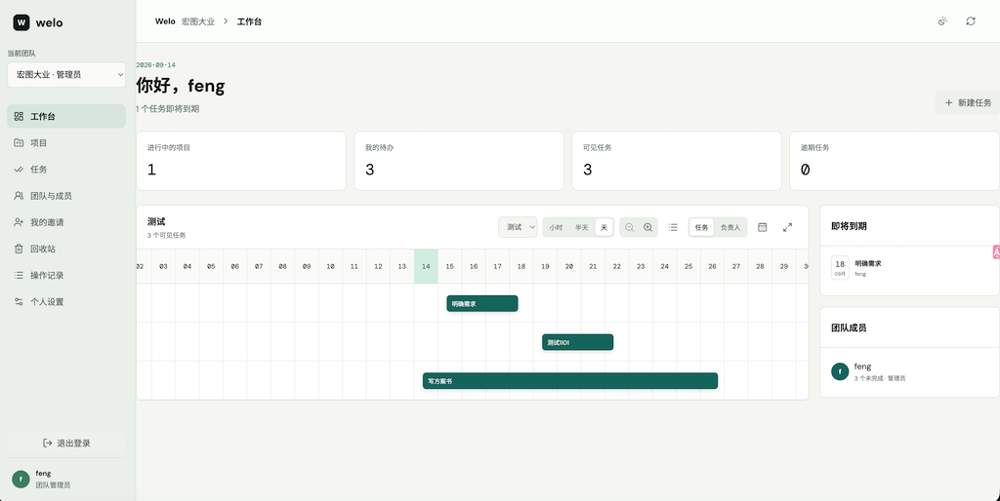

# Welo 多团队任务管理系统

Welo 是一个面向多团队协作的任务管理系统。系统以团队组织人员并隔离业务数据，以项目承载协作，用任务驱动执行，并通过甘特图查看和调整排期。

当前版本为 V2，已实现真实前后端主流程，不再依赖前端 mock 数据。

## 项目声明

- 除第三方依赖、平台运行时和外部字体外，本项目源代码全部由 AI 生成。
- 项目体验地址：[https://welo.909939.xyz/](https://welo.909939.xyz/)

## 首页截图



新版团队协作方案见 [团队协作与权限完整设计文档](./Docs/团队协作与权限设计文档.md)：所有用户可自行创建团队，创建者担任团队管理员，团队内成员共享项目和任务操作权限。

## 核心能力

- 用户注册、登录、退出和会话恢复
- 任意用户自助创建团队；团队创建者担任唯一团队管理员
- 邀请加入、接受 / 拒绝、撤销邀请、移除成员和成员主动退出
- 团队内项目创建、查询、更新、归档和删除
- 任务创建、详情、状态、优先级、负责人和起止时间管理
- 团队内项目与任务协作，所有有效成员共享业务操作权限
- 甘特图排期展示与拖拽保存，使用 `updatedAt` 做乐观并发控制
- 工作台统计、最近项目、临近截止任务
- 超级管理员平台概览、全部用户只读列表和全部项目只读列表
- 登录连续失败锁定与过期会话定时清理

普通成员只能看到自己已加入团队的业务数据；超级管理员仅可只读查看全部用户和全部项目目录，不能查看任务详情或绕过团队业务写权限。所有可见性过滤都在服务端完成，前端只负责展示，不自行放宽权限。

## 技术架构

```text
frontend-prototype (Vite SPA)
        |
        |  /api/v1/*, credentials: include
        v
Cloudflare Worker (Hono API)
        |
        +-- Cloudflare D1 (SQLite)
        +-- Cron Trigger (每 30 分钟清理过期 sessions)
```

| 层 | 技术 |
| --- | --- |
| API Runtime | Cloudflare Workers module worker |
| API 框架 | Hono |
| 参数与数据校验 | Zod |
| 数据库 | Cloudflare D1 |
| 前端构建 | Vite |
| 前端 UI | 原生 ES Module、Lucide 图标 |
| API 契约 | OpenAPI 3.0 |

后端入口是 `src/index.ts`，数据库 binding 名为 `DB`。后端不保存内存会话，不依赖本地文件写入；登录会话保存在 D1 `sessions` 表中，并通过 HttpOnly Cookie 传递。

## 第三方库与外部服务

### 直接依赖

| 类别 | 名称 | 当前锁定版本 | 类型 / 许可证 | 用途 |
| --- | --- | --- | --- | --- |
| 后端运行依赖 | Hono | 4.13.7 | 开源，MIT | Workers API 框架、路由和 CORS 中间件 |
| 后端运行依赖 | Zod | 4.5.4 | 开源，MIT | 请求参数与业务字段校验 |
| 前端运行依赖 | Lucide | 1.41.0 | 开源，ISC | 图标组件与图标资源 |
| 后端开发依赖 | TypeScript | 5.9.3 | 开源，Apache-2.0 | 类型检查 |
| 后端开发依赖 | Wrangler | 4.129.0 | 开源，MIT OR Apache-2.0 | Workers 本地开发、D1 迁移和部署 CLI |
| 后端开发依赖 | `@cloudflare/workers-types` | 5.20260907.1 | 开源，MIT OR Apache-2.0 | Workers Runtime 类型定义 |
| 前端开发依赖 | Vite | 7.3.6 | 开源，MIT | 前端开发服务器与生产构建 |
| 前端开发依赖 | Prettier | 3.9.6 | 开源，MIT | 前端代码格式化 |
| 前端开发依赖 | `@playwright/test` | 1.63.0 | 开源，Apache-2.0 | 预留浏览器自动化测试工具，当前主测试脚本尚未执行 Playwright 用例 |

### 重要传递依赖

这些库未在 `package.json` 中直接声明，由上述工具引入，完整版本和许可证元数据以 [package-lock.json](./package-lock.json) 与 [frontend-prototype/package-lock.json](./frontend-prototype/package-lock.json) 为准。

| 名称 | 类型 / 许可证 | 引入来源与用途 |
| --- | --- | --- |
| esbuild | 开源，MIT | Vite / Wrangler 构建与打包 |
| Rollup | 开源，MIT | Vite 前端模块打包 |
| PostCSS | 开源，MIT | Vite 样式处理 |
| Miniflare | 开源，MIT | Wrangler 本地 Workers / D1 模拟环境 |
| workerd | 开源，Apache-2.0 | Workers 兼容运行时实现 |
| undici | 开源，MIT | Wrangler / 开发工具网络请求 |
| sharp 及其平台二进制包 | 开源，Apache-2.0；部分 libvips 二进制包含 LGPL-3.0-or-later 组件 | Wrangler 工具链图片处理能力 |

### 字体与外部服务

| 名称 | 类型 | 说明 |
| --- | --- | --- |
| DM Sans、DM Mono、Noto Sans SC | 开源字体，SIL Open Font License 1.1 | 通过 Google Fonts CSS 引用；项目仓库不打包字体文件 |
| Google Fonts | 外部字体分发服务 | 前端页面从 `fonts.googleapis.com` 加载字体 |
| Cloudflare Workers、D1、Cron Trigger、Pages | 商业云服务，服务端实现闭源 | API 运行时、SQLite 兼容数据库、定时任务和前端托管；实际费用与可用性取决于 Cloudflare 服务计划 |
| SQLite | 开源 / 公有领域 | D1 提供 SQLite 兼容接口；本项目的迁移和初始化 SQL 面向该兼容模型 |

截至本次梳理，项目没有打包闭源 npm 库、商业 SDK、商业字体或需要按席位授权的第三方组件。部署和访问会依赖上述外部托管服务。

## 环境要求

- Node.js 22 LTS 或更新版本
- npm 10 或更新版本
- 本地开发不需要 Cloudflare 账户；远程部署和远程 D1 迁移需要 Cloudflare 账户

## 本地开发

仓库包含两个独立的 npm 工程：根目录是 Worker API，`frontend-prototype/` 是前端应用。两边需要分别安装依赖。

### 1. 启动后端

```bash
npm ci
npm run db:migrate:local
npm run dev
```

后端默认监听：

```text
http://localhost:8787
```

健康检查：

```text
http://localhost:8787/health
```

### 2. 启动前端

保持后端进程运行，另开一个终端：

```bash
npm --prefix frontend-prototype ci
npm run frontend:dev
```

前端默认监听：

```text
http://localhost:5173
```

Vite 会把 `/api/*` 和 `/health` 代理到本地 Worker。默认代理地址是 `http://localhost:8787`。

## 本地配置

### Worker 变量

`wrangler.jsonc` 默认提供生产值，`npm run dev` 会使用其中的 `development` 环境：

| 变量 | 本地值 | 说明 |
| --- | --- | --- |
| `ENVIRONMENT` | `development` | `/health` 与日志中的环境标识 |
| `SESSION_TTL_DAYS` | `14` | 登录会话有效天数 |
| `CORS_ORIGINS` | `http://localhost:5173,http://localhost:8787` | 允许携带 Cookie 的来源白名单 |

如需临时覆盖本地敏感配置，可以创建 `.dev.vars`。该文件已被忽略，不应提交。

### 前端变量

复制前端示例配置：

```bash
cp frontend-prototype/.env.example frontend-prototype/.env.local
```

| 变量 | 默认行为 | 说明 |
| --- | --- | --- |
| `VITE_API_BASE_URL` | 留空，请求同域 `/api/v1` | 前端与 API 不同域名时填写完整 API 前缀 |
| `API_PROXY_TARGET` | `http://localhost:8787` | 仅本地 Vite 代理使用 |

本地开发通常保持 `VITE_API_BASE_URL` 为空，由 Vite 代理转发请求。

## 验证与构建

后端类型检查：

```bash
npm run build
```

前端生产构建：

```bash
npm run frontend:build
```

完整检查：

```bash
npm test
```

`npm test` 会执行后端 TypeScript 检查、前端格式检查和前端生产构建。当前自动化验证以构建和格式为主，业务接口回归仍需要结合本地 Worker 与 D1 数据手工验证。

## 数据库迁移

本地迁移：

```bash
npm run db:migrate:local
```

远程迁移：

```bash
npm run db:migrate:remote
```

迁移文件位于 `migrations/`。新增迁移时请使用递增文件名，不要修改已经在环境中执行过的迁移。

当前 `wrangler.jsonc` 中的 `database_id` 是本地开发占位值：

```text
local-development
```

部署到 Cloudflare 前，必须先在 D1 控制台创建数据库，并把该值替换为真实 Database ID。远程迁移和部署前请再次确认目标数据库，避免误操作生产数据。

## 目录说明

| 路径 | 说明 |
| --- | --- |
| `src/` | Worker API、认证、响应和工具函数 |
| `frontend-prototype/` | Vite 前端应用 |
| `migrations/` | D1 数据库迁移 |
| `Docs/api-docs.yaml` | OpenAPI 契约 |
| `Docs/产品设计文档.md` | 产品定位、角色权限和页面流程 |
| `Docs/后端详细设计文档.md` | Worker、D1 和 API 设计 |
| `Docs/数据库设计文档.md` | 数据模型与约束设计 |
| `Docs/前端接入说明.md` | 前端调用 API 的详细约定 |
| `Docs/Cloudflare部署文档.md` | Cloudflare 控制台部署步骤 |

## API 契约

API 契约见 [api-docs.yaml](./Docs/api-docs.yaml)，可导入 Swagger UI、Apifox 或其他 OpenAPI 兼容工具。

统一 API 前缀为：

```text
/api/v1
```

认证支持：

- HttpOnly Cookie：`welo_session`
- `Authorization: Bearer <token>`

## 部署

生产部署目标为：

- 后端：Cloudflare Workers
- 数据库：Cloudflare D1
- 前端：Cloudflare Pages

完整控制台操作、D1 创建、binding、环境变量、CORS、Cron、Pages 配置、自定义域名和验收清单见 [Cloudflare部署文档.md](./Docs/Cloudflare部署文档.md)。

## 安全约定

- 密码只保存哈希，不保存明文
- 会话令牌只保存哈希，不保存明文
- Cookie 使用 `HttpOnly`、`Secure`、`SameSite=Lax`
- 生产 CORS 只允许明确的前端来源，不使用 `*`
- 服务端统一执行团队、小组和管理员权限校验
- 不可见资源统一返回 `404`，避免暴露存在性
- API Token、密码、Cookie 和数据库凭证不应写入仓库或日志
