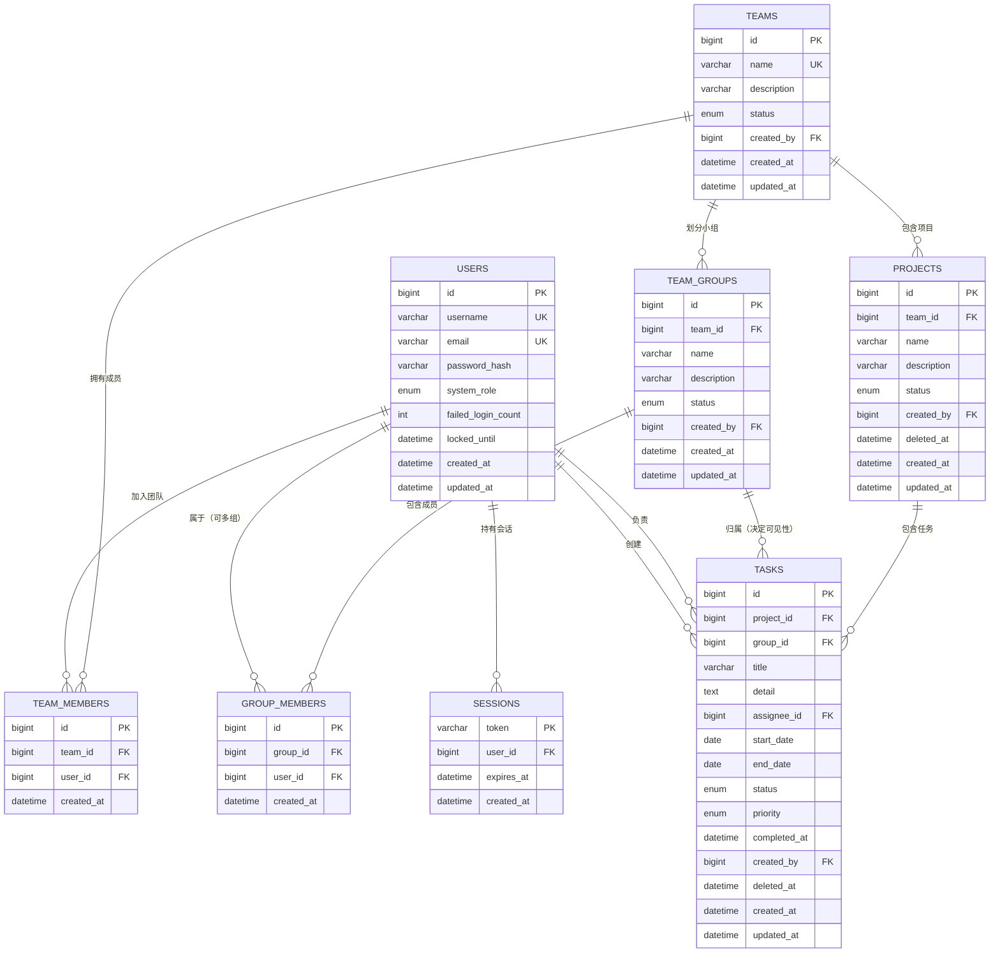

# Welo 任务管理系统数据库详细设计

| 项目 | 内容 |
| --- | --- |
| 文档版本 | V1.0 |
| 撰写日期 | 2026-09-07 |
| 关联文档 | [产品设计文档.md](./产品设计文档.md) |
| 数据库 | MySQL 8.0+（InnoDB，utf8mb4 / utf8mb4_0900_ai_ci） |
| 建表脚本 | [schema.sql](./schema.sql) |

---

## 1. 设计约定

1. 表名、字段名统一小写蛇形命名；表名用复数（如 `tasks`）；
2. 所有表主键为 `id BIGINT UNSIGNED AUTO_INCREMENT`，采用数据库自增 ID（V1 不引入分布式 ID）；
3. `GROUPS` 是 MySQL 8.0 保留字，小组实体对应表命名为 `team_groups`；
4. 时间字段使用 `DATETIME`，任务起止日期使用 `DATE`（按天粒度，与甘特图日网格一致）；
5. 邮箱统一转小写后存储，利用 `utf8mb4_0900_ai_ci` 大小写不敏感排序规则保证唯一；
6. 项目、任务采用软删除（`deleted_at`），用户、组织关系采用硬删除；
7. 密码只存哈希（`password_hash`），任何表不得出现明文密码字段；
8. 金额/状态等枚举使用 MySQL `ENUM`，应用层同步维护枚举字典；
9. 跨表业务规则（如「负责人必须属于任务小组」）由服务层在事务中校验，数据库不使用触发器。

---

## 2. ER 图（Mermaid）



---

## 3. 表清单

| 序号 | 表名 | 说明 | 预估量级（3 年） |
| --- | --- | --- | --- |
| 1 | users | 用户表 | 1 万 |
| 2 | teams | 团队表 | 100 |
| 3 | team_members | 团队成员关系表 | 2 万 |
| 4 | team_groups | 小组表（Group，避免保留字） | 1 千 |
| 5 | group_members | 小组成员关系表（多对多，支撑一人多组） | 5 万 |
| 6 | projects | 项目表 | 1 万 |
| 7 | tasks | 任务表 | 100 万 |
| 8 | sessions | 登录会话表 | 20 万（活跃会话） |

---

## 4. 表结构详细设计

### 4.1 users（用户表）

| 字段 | 类型 | 允许空 | 默认值 | 说明 |
| --- | --- | --- | --- | --- |
| id | BIGINT UNSIGNED | 否 | 自增 | 主键 |
| username | VARCHAR(32) | 否 | 无 | 用户名，系统内唯一，2-32 字符 |
| email | VARCHAR(255) | 否 | 无 | 邮箱，统一转小写后存储，系统内唯一 |
| password_hash | VARCHAR(255) | 否 | 无 | 密码哈希（bcrypt 60 字符 / argon2，预留长度） |
| system_role | ENUM('super_admin','member') | 否 | 'member' | 平台角色：超级管理员 / 普通人员 |
| failed_login_count | INT UNSIGNED | 否 | 0 | 连续登录失败次数，登录成功后清零 |
| locked_until | DATETIME | 是 | NULL | 账号锁定截止时间，NULL 表示未锁定 |
| created_at | DATETIME | 否 | CURRENT_TIMESTAMP | 注册时间 |
| updated_at | DATETIME | 否 | CURRENT_TIMESTAMP ON UPDATE | 更新时间 |

约束与索引：

| 类型 | 名称 | 字段 | 说明 |
| --- | --- | --- | --- |
| 主键 | PK | id | |
| 唯一 | uk_users_username | username | 用户名唯一 |
| 唯一 | uk_users_email | email | 邮箱唯一 |
| 普通 | idx_users_system_role | system_role | 超管后台按平台角色筛选 |

### 4.2 teams（团队表）

| 字段 | 类型 | 允许空 | 默认值 | 说明 |
| --- | --- | --- | --- | --- |
| id | BIGINT UNSIGNED | 否 | 自增 | 主键 |
| name | VARCHAR(64) | 否 | 无 | 团队名称，全局唯一 |
| description | VARCHAR(500) | 是 | NULL | 团队描述 |
| status | ENUM('active','archived') | 否 | 'active' | active=正常，archived=归档只读 |
| created_by | BIGINT UNSIGNED | 否 | 无 | 创建人，指向 users.id |
| created_at | DATETIME | 否 | CURRENT_TIMESTAMP | 创建时间 |
| updated_at | DATETIME | 否 | CURRENT_TIMESTAMP ON UPDATE | 更新时间 |

约束与索引：

| 类型 | 名称 | 字段 | 说明 |
| --- | --- | --- | --- |
| 主键 | PK | id | |
| 唯一 | uk_teams_name | name | 团队名全局唯一，便于顶部切换检索 |
| 外键 | fk_teams_creator | created_by → users.id | RESTRICT |

### 4.3 team_members（团队成员关系表）

| 字段 | 类型 | 允许空 | 默认值 | 说明 |
| --- | --- | --- | --- | --- |
| id | BIGINT UNSIGNED | 否 | 自增 | 主键 |
| team_id | BIGINT UNSIGNED | 否 | 无 | 团队 ID |
| user_id | BIGINT UNSIGNED | 否 | 无 | 用户 ID |
| created_at | DATETIME | 否 | CURRENT_TIMESTAMP | 加入时间 |

约束与索引：

| 类型 | 名称 | 字段 | 说明 |
| --- | --- | --- | --- |
| 主键 | PK | id | |
| 唯一 | uk_team_members | (team_id, user_id) | 一个用户在一个团队只有一条成员记录 |
| 普通 | idx_team_members_user | user_id | 反查「我加入的团队」 |
| 外键 | fk_tm_team | team_id → teams.id | ON DELETE CASCADE |
| 外键 | fk_tm_user | user_id → users.id | ON DELETE CASCADE |

### 4.4 team_groups（小组表）

| 字段 | 类型 | 允许空 | 默认值 | 说明 |
| --- | --- | --- | --- | --- |
| id | BIGINT UNSIGNED | 否 | 自增 | 主键 |
| team_id | BIGINT UNSIGNED | 否 | 无 | 所属团队 |
| name | VARCHAR(64) | 否 | 无 | 小组名称，团队内唯一 |
| description | VARCHAR(500) | 是 | NULL | 小组描述 |
| status | ENUM('active','disabled') | 否 | 'active' | active=启用，disabled=停用（不可新建任务） |
| created_by | BIGINT UNSIGNED | 否 | 无 | 创建人 |
| created_at | DATETIME | 否 | CURRENT_TIMESTAMP | 创建时间 |
| updated_at | DATETIME | 否 | CURRENT_TIMESTAMP ON UPDATE | 更新时间 |

约束与索引：

| 类型 | 名称 | 字段 | 说明 |
| --- | --- | --- | --- |
| 主键 | PK | id | |
| 唯一 | uk_team_groups | (team_id, name) | 团队内小组名唯一 |
| 外键 | fk_tg_team | team_id → teams.id | ON DELETE CASCADE |
| 外键 | fk_tg_creator | created_by → users.id | RESTRICT |

### 4.5 group_members（小组成员关系表，核心）

| 字段 | 类型 | 允许空 | 默认值 | 说明 |
| --- | --- | --- | --- | --- |
| id | BIGINT UNSIGNED | 否 | 自增 | 主键 |
| group_id | BIGINT UNSIGNED | 否 | 无 | 小组 ID |
| user_id | BIGINT UNSIGNED | 否 | 无 | 用户 ID |
| created_at | DATETIME | 否 | CURRENT_TIMESTAMP | 加入时间 |

约束与索引：

| 类型 | 名称 | 字段 | 说明 |
| --- | --- | --- | --- |
| 主键 | PK | id | |
| 唯一 | uk_group_members | (group_id, user_id) | 同一小组内不重复 |
| 普通 | idx_group_members_user | user_id | 反查「我所属的小组」，驱动任务可见性过滤 |
| 外键 | fk_gm_group | group_id → team_groups.id | ON DELETE CASCADE |
| 外键 | fk_gm_user | user_id → users.id | ON DELETE CASCADE |

设计要点：

1. 该表是「一人可属于多个小组」的直接落地，同一 `user_id` 可出现多行（分属不同 `group_id`）；
2. 任务可见性查询的入口索引是 `idx_group_members_user`，配合 `tasks.idx_tasks_project_group` 完成过滤。

### 4.6 projects（项目表）

| 字段 | 类型 | 允许空 | 默认值 | 说明 |
| --- | --- | --- | --- | --- |
| id | BIGINT UNSIGNED | 否 | 自增 | 主键 |
| team_id | BIGINT UNSIGNED | 否 | 无 | 所属团队 |
| name | VARCHAR(64) | 否 | 无 | 项目名称，团队内唯一 |
| description | VARCHAR(2000) | 是 | NULL | 项目描述 |
| status | ENUM('active','archived') | 否 | 'active' | active=进行中，archived=已归档（只读） |
| created_by | BIGINT UNSIGNED | 否 | 无 | 创建人 |
| deleted_at | DATETIME | 是 | NULL | 软删除时间，NULL 表示未删除 |
| created_at | DATETIME | 否 | CURRENT_TIMESTAMP | 创建时间 |
| updated_at | DATETIME | 否 | CURRENT_TIMESTAMP ON UPDATE | 更新时间 |

约束与索引：

| 类型 | 名称 | 字段 | 说明 |
| --- | --- | --- | --- |
| 主键 | PK | id | |
| 唯一 | uk_projects | (team_id, name) | 团队内项目名唯一 |
| 外键 | fk_projects_team | team_id → teams.id | RESTRICT |
| 外键 | fk_projects_creator | created_by → users.id | RESTRICT |

说明：软删除期间项目名仍被唯一索引占用（30 天恢复窗口内不允许同名重建），窗口结束后由清理任务物理删除，名称即可复用。

### 4.7 tasks（任务表，核心）

| 字段 | 类型 | 允许空 | 默认值 | 说明 |
| --- | --- | --- | --- | --- |
| id | BIGINT UNSIGNED | 否 | 自增 | 主键 |
| project_id | BIGINT UNSIGNED | 否 | 无 | 所属项目，先建项目再建任务的约束载体 |
| group_id | BIGINT UNSIGNED | 否 | 无 | 所属小组，决定任务可见性 |
| title | VARCHAR(200) | 否 | 无 | 标题，必填 |
| detail | TEXT | 是 | NULL | 详细内容，选填，应用层限制 10000 字符 |
| assignee_id | BIGINT UNSIGNED | 否 | 无 | 负责人，必填 |
| start_date | DATE | 是 | NULL | 开始时间，选填 |
| end_date | DATE | 否 | 无 | 结束时间，必填 |
| status | ENUM('todo','in_progress','done') | 否 | 'todo' | 任务状态 |
| priority | ENUM('low','medium','high','urgent') | 否 | 'medium' | 优先级 |
| completed_at | DATETIME | 是 | NULL | 完成时间，status=done 时必填，其他状态为空 |
| created_by | BIGINT UNSIGNED | 否 | 无 | 创建人 |
| deleted_at | DATETIME | 是 | NULL | 软删除时间 |
| created_at | DATETIME | 否 | CURRENT_TIMESTAMP | 创建时间 |
| updated_at | DATETIME | 否 | CURRENT_TIMESTAMP ON UPDATE | 更新时间（甘特拖拽保存会触发） |

约束与索引：

| 类型 | 名称 | 字段/表达式 | 说明 |
| --- | --- | --- | --- |
| 主键 | PK | id | |
| 普通 | idx_tasks_project_group | (project_id, group_id) | 核心可见性查询：项目 + 小组过滤 |
| 普通 | idx_tasks_assignee | (assignee_id, status) | 「我的任务」「我未完成的任务」 |
| 普通 | idx_tasks_end_date | end_date | 列表默认按结束时间排序、逾期筛选 |
| 普通 | idx_tasks_group | group_id | 迁移/清理小组时按组查任务 |
| 外键 | fk_tasks_project | project_id → projects.id | RESTRICT（项目仅软删，不物理删除） |
| 外键 | fk_tasks_group | group_id → team_groups.id | RESTRICT（小组有任务时不允许物理删除） |
| 外键 | fk_tasks_assignee | assignee_id → users.id | RESTRICT |
| 外键 | fk_tasks_creator | created_by → users.id | RESTRICT |
| CHECK | chk_tasks_date_range | start_date IS NULL OR start_date <= end_date | 开始时间不得晚于结束时间 |
| CHECK | chk_tasks_completed | (status='done' AND completed_at IS NOT NULL) OR (status<>'done' AND completed_at IS NULL) | 完成状态与完成时间保持一致 |

### 4.8 sessions（会话表）

| 字段 | 类型 | 允许空 | 默认值 | 说明 |
| --- | --- | --- | --- | --- |
| token | VARCHAR(64) | 否 | 无 | 会话令牌（服务端生成的随机串），主键 |
| user_id | BIGINT UNSIGNED | 否 | 无 | 用户 ID |
| expires_at | DATETIME | 否 | 无 | 过期时间 |
| created_at | DATETIME | 否 | CURRENT_TIMESTAMP | 创建时间 |

约束与索引：

| 类型 | 名称 | 字段 | 说明 |
| --- | --- | --- | --- |
| 主键 | PK | token | 按 token 查会话 |
| 普通 | idx_sessions_user | user_id | 用户退出登录时批量删除会话 |
| 普通 | idx_sessions_expires | expires_at | 定时清理过期会话 |
| 外键 | fk_sessions_user | user_id → users.id | ON DELETE CASCADE |

---

## 5. 枚举字典

| 字段 | 取值 | 含义 |
| --- | --- | --- |
| teams.status | active / archived | 正常 / 已归档（只读） |
| users.system_role | super_admin / member | 超级管理员 / 普通人员 |
| team_groups.status | active / disabled | 启用 / 停用（历史保留、不可新建任务） |
| projects.status | active / archived | 进行中 / 已归档（只读） |
| tasks.status | todo / in_progress / done | 待办 / 进行中 / 已完成 |
| tasks.priority | low / medium / high / urgent | 低 / 中 / 高 / 紧急 |

---

## 6. 跨表业务规则（服务层事务保证）

数据库外键只保证引用存在性，以下一致性规则由服务层在同一个事务中校验：

| 编号 | 规则 | 校验时机 |
| --- | --- | --- |
| R1 | group_members.user 必须已属于 team_groups 对应团队的 team_members | 添加小组成员时 |
| R2 | tasks.group 必须属于 tasks.project 对应的团队 | 创建 / 修改任务小组时 |
| R3 | tasks.assignee 必须属于 tasks.group | 创建 / 修改负责人时 |
| R4 | 普通人员创建项目时必须存在对应 team_members 记录；超管不受此限制 | 创建项目事务 |
| R5 | 普通人员修改任务时必须属于项目团队，且属于任务小组；超管不受此限制 | 修改任务事务 |
| R6 | 仅超管可以创建/删除团队、管理团队成员与小组成员 | 组织管理事务 |
| R7 | 移出团队前，必须先将其移出该团队下所有小组、转让其负责任务 | 移出成员事务 |
| R8 | 任务完成时写入 completed_at；回退状态时清空 completed_at | 更新任务状态事务 |

---

## 7. 核心查询设计

### 7.1 项目内可见任务（权限核心查询）

普通人员可见任务 = 所属团队内，用户所属小组任务的并集：

```sql
SELECT t.*
FROM tasks t
JOIN team_groups g ON g.id = t.group_id
JOIN group_members gm
  ON gm.group_id = g.id
 AND gm.user_id = :userId
WHERE t.project_id = :projectId
  AND t.deleted_at IS NULL
ORDER BY t.end_date ASC;
```

执行路径：`idx_group_members_user(user_id)` 取用户小组 → `idx_tasks_project_group(project_id, group_id)` 过滤任务。

超级管理员不参与小组过滤，直接查询项目下全部任务：

```sql
SELECT t.*
FROM tasks t
WHERE t.project_id = :projectId
  AND t.deleted_at IS NULL
ORDER BY t.end_date ASC;
```

服务端必须先从可信会话读取 `users.system_role`，再选择查询分支，不得接受前端传入的角色值。

### 7.2 我负责任务（跨项目）

```sql
SELECT t.*
FROM tasks t
JOIN projects p ON p.id = t.project_id
JOIN team_members tm
  ON tm.team_id = p.team_id
 AND tm.user_id = :userId
WHERE t.assignee_id = :userId
  AND t.status <> 'done'
  AND t.deleted_at IS NULL
ORDER BY t.end_date ASC;
```

### 7.3 甘特图数据查询

```sql
SELECT t.id, t.title, t.assignee_id, t.start_date, t.end_date, t.status, t.priority
FROM tasks t
JOIN group_members gm
  ON gm.group_id = t.group_id
 AND gm.user_id = :userId
WHERE t.project_id = :projectId
  AND t.deleted_at IS NULL;
```

应用层将 `start_date IS NULL` 的任务按 `end_date` 当天渲染为 1 天虚线条；甘特拖拽保存调用 `UPDATE tasks SET start_date = :sd, end_date = :ed, updated_at = NOW() WHERE id = :id AND deleted_at IS NULL`，并复用 R5 权限校验。

### 7.4 用户在某团队的可见小组

```sql
SELECT g.id, g.name
FROM team_groups g
JOIN group_members gm ON gm.group_id = g.id
JOIN team_members tm ON tm.team_id = g.team_id AND tm.user_id = gm.user_id
WHERE g.team_id = :teamId
  AND gm.user_id = :userId
  AND g.status = 'active';
```

---

## 8. 索引与性能说明

1. 任务可见性是全系统最高频查询，`tasks(project_id, group_id)` 与 `group_members(user_id)` 构成黄金组合，先以用户反查小组集合，再做任务过滤；
2. 任务默认按结束时间升序排列，`idx_tasks_end_date` 避免大项目内排序代价；
3. 「我的任务」入口高频，`(assignee_id, status)` 覆盖「我未完成」的过滤；
4. 会话表按 token 主键点查，写多读少，靠 `idx_sessions_expires` 定期清理；
5. 按 3 年 100 万任务估算，上述索引下单查询毫秒级，单库单表足够；V2 引入评论、附件后再评估分表。

---

## 9. 扩展表规划（本期不建表）

| 版本 | 表 | 说明 |
| --- | --- | --- |
| V1.1 | task_logs | 任务操作历史（状态流转、字段变更、甘特拖拽记录） |
| V1.1 | password_reset_tokens | 修改密码 / 找回密码令牌 |
| V2 | comments | 任务评论 |
| V2 | attachments | 任务附件 |
| V2 | task_dependencies | 任务依赖（甘特连线），自关联 tasks |

---

## 10. 变更记录

| 版本 | 日期 | 变更 |
| --- | --- | --- |
| V1.0 | 2026-09-07 | 初稿：8 张核心表、Mermaid ER 图、约束与索引设计；权限简化为超管 / 普通人员两级 |
